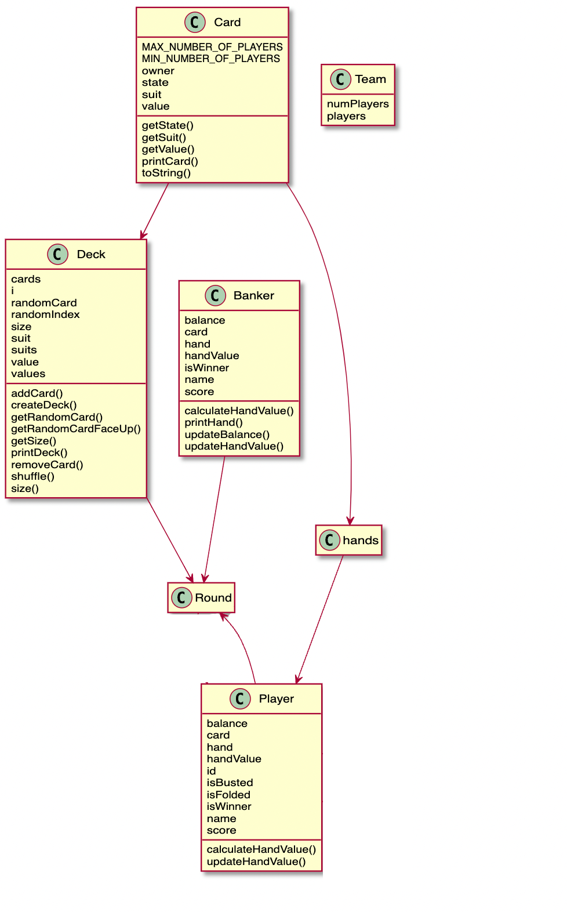
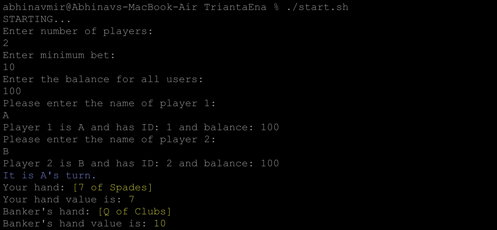
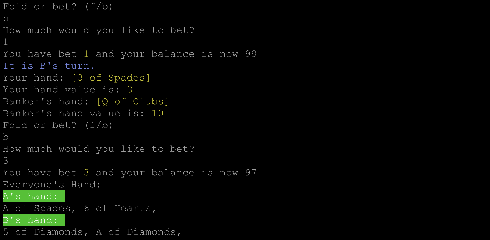
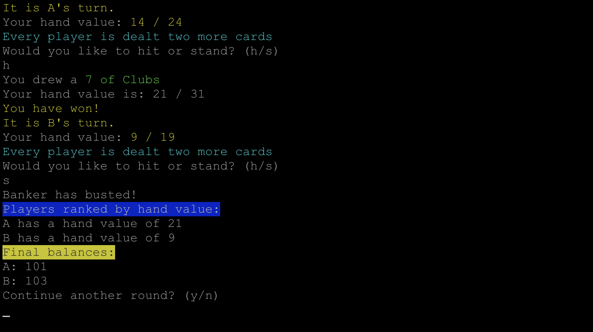

# Java Blackjack

## Files

- Main.java
- Round.java

## Notes

You can quickly run the program by running `./misc/start.sh`.

## How to compile and run

1. Navigate to the directory "pa2" after unzipping the files (pa2 = personal assistant 2 - redid a main helper code and forgot to rename a bunch of things, have to cleanup!)
2. Run the following instructions:
   ```shell
   mkdir bin && javac -d bin *.java
   javac ./bin/Main.java
   ```


## 1. Considerations

#### 1.1 Constraints
The implementation requires a variant of Blackjack called Trianta Ena. There are some changes in rules and card distribution method. 

#### 1.2 Quick testing
To make sure we can quickly iterate and set up a game, I use command line arguments. For a quick spin, you can run `./start.sh` in the source file. For fine tuning the parameter, the template is as follows.

```shell
java Main <NUMBER OF PLAYERS> <MINIMUM BET> <BALANCE FOR ALL PLAYERS> <NAME OF PLAYERS (divided by space)>
```

## 2. Architecture



#### 2.1 Overview

The deck is a class with subclass card (although it is not implemented as a direct subclass). The card has multiple members - an enum for state, suit and value. An arrayList of the card results in both deck and hand - and the card is then transfered between these two for logistics. The rules are implemented over simple loops - I avoided using the `ruleSet` interface from ticTacToe since the rules are differently implemented.

## 3 Terminal User Interface



The game starts with taking user input on Round details and then moves on to the folding and betting round.



The player here has all the information and choose to play or fold. Once they decide to play, the money goes to the pot and game continues. They are also dealt two more cards after that.



Now the players can choose to hit or stand. The rules apply. Winners get 2x the amount they bet, losers get nothing. Banker rules apply as usual. You can then choose to play another round.

## Input/Output Example

```shell
STARTING...
Enter number of players:
2
Enter minimum bet:
10
Enter the balance for all users:
100
Please enter the name of player 1:
A
Player 1 is A and has ID: 1 and balance: 100
Please enter the name of player 2:
B
Player 2 is B and has ID: 2 and balance: 100
It is A's turn.
Your hand: [7 of Spades]
Your hand value is: 7
Banker's hand: [Q of Clubs]
Banker's hand value is: 10
Fold or bet? (f/b)
b
How much would you like to bet?
1
You have bet 1 and your balance is now 99
It is B's turn.
Your hand: [3 of Spades]
Your hand value is: 3
Banker's hand: [Q of Clubs]
Banker's hand value is: 10
Fold or bet? (f/b)
b
How much would you like to bet?
3
You have bet 3 and your balance is now 97
Everyone's Hand:
A's hand:
A of Spades, 6 of Hearts,
B's hand:
5 of Diamonds, A of Diamonds,
It is A's turn.
Your hand value: 14 / 24
Every player is dealt two more cards
Would you like to hit or stand? (h/s)
h
You drew a 7 of Clubs
Your hand value is: 21 / 31
You have won!
It is B's turn.
Your hand value: 9 / 19
Every player is dealt two more cards
Would you like to hit or stand? (h/s)
s
Banker has busted!
Players ranked by hand value:
A has a hand value of 21
B has a hand value of 9
Final balances:
A: 101
B: 103
Continue another round? (y/n)

```
