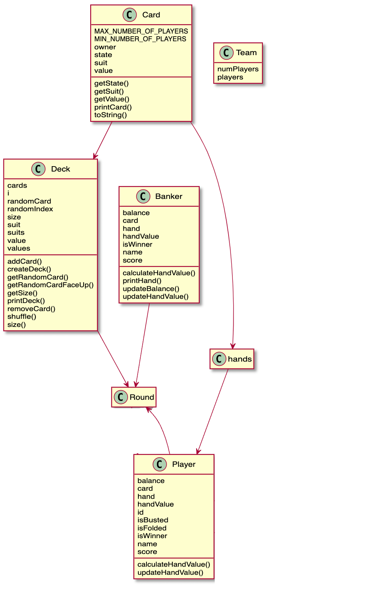
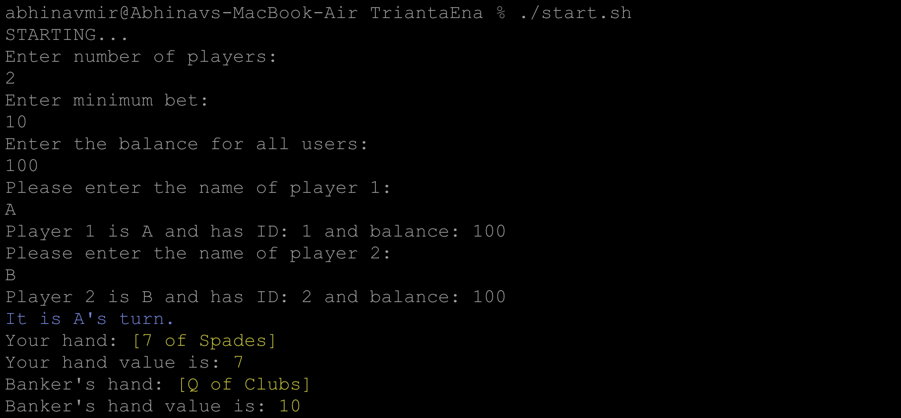
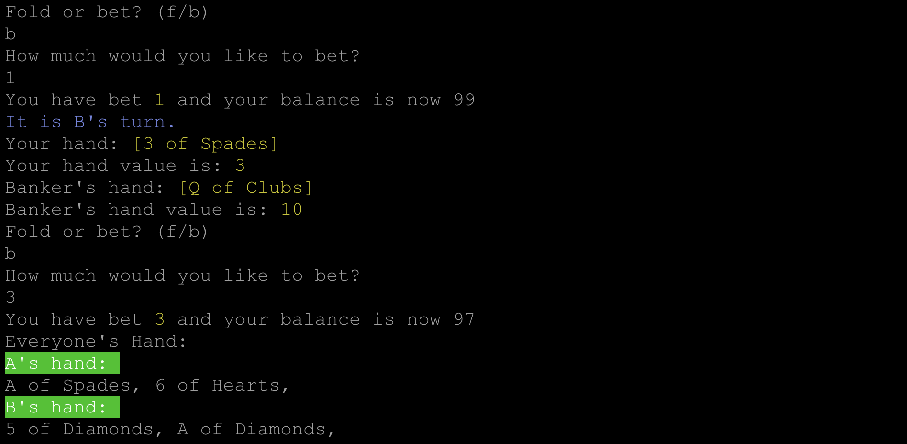
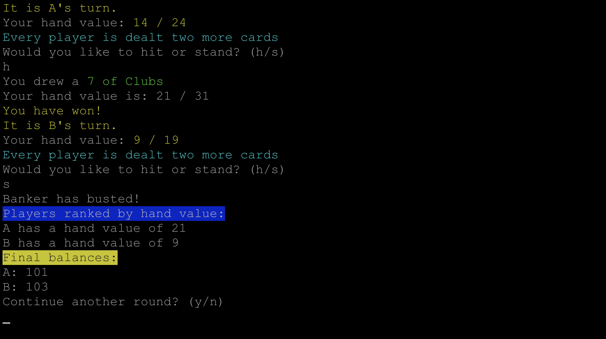

# Design Document


## 1. Considerations

#### 1.1 Constraints
The implementation requires a variant of Blackjack called Trianta Ena. There are some changes in rules and card distribution method. 

#### 1.2 Quick testing
To make sure we can quickly iterate and set up a game, I use command line arguments. For a quick spin, you can run `./start.sh` in the source file. For fine tuning the parameter, the template is as follows.

```javascript
java Main <NUMBER OF PLAYERS> <MINIMUM BET> <BALANCE FOR ALL PLAYERS> <NAME OF PLAYERS (divided by space)>
```

## 2. Architecture



#### 2.1 Overview

The deck is a class with subclass card (although it is not implemented as a direct subclass). The card has multiple members - an enum for state, suit and value. An arrayList of the card results in both deck and hand - and the card is then transfered between these two for logistics. The rules are implemented over simple loops - I avoided using the `ruleSet` interface from ticTacToe since the rules are differently implemented.

## 3 Terminal User Interface



The game starts with taking user input on Round details and then moves on to the folding and betting round.



The player here has all the information and choose to play or fold. Once they decide to play, the money goes to the pot and game continues. They are also dealt two more cards after that.



Now the players can choose to hit or stand. The rules apply. Winners get 2x the amount they bet, losers get nothing. Banker rules apply as usual. You can then choose to play another round.